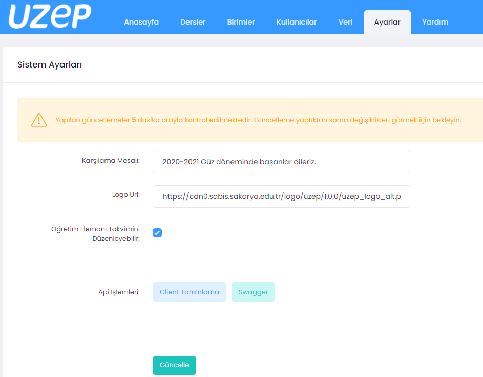
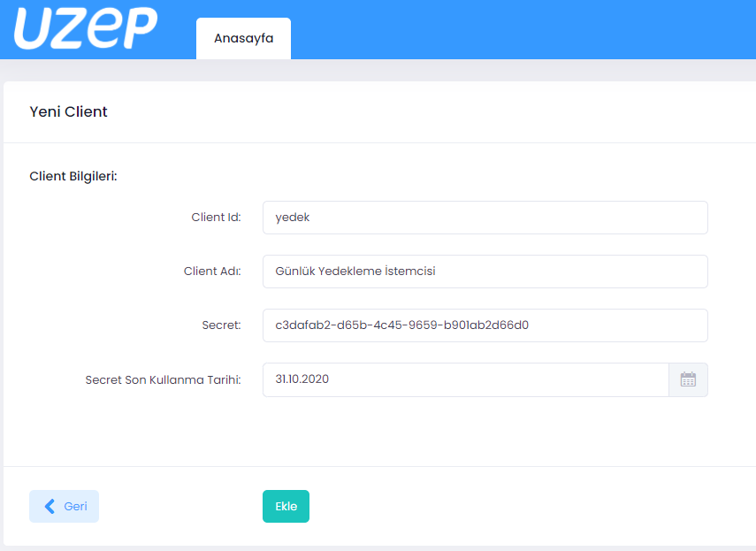
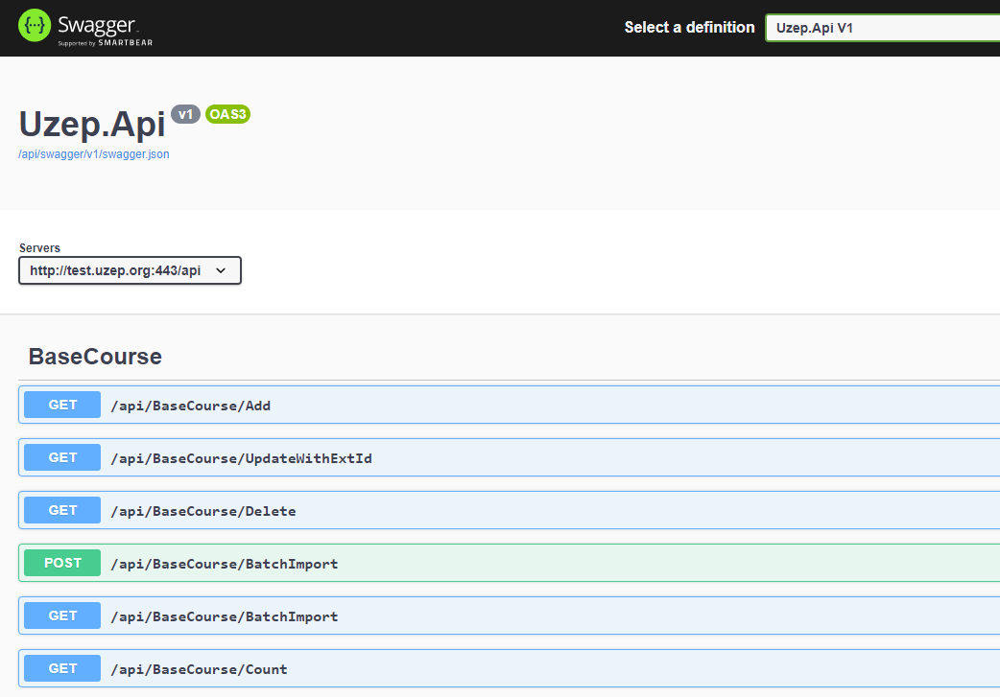
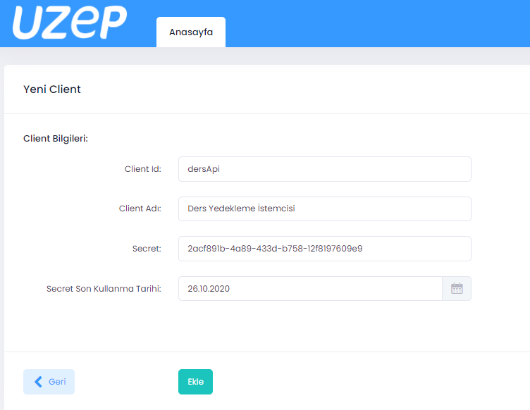
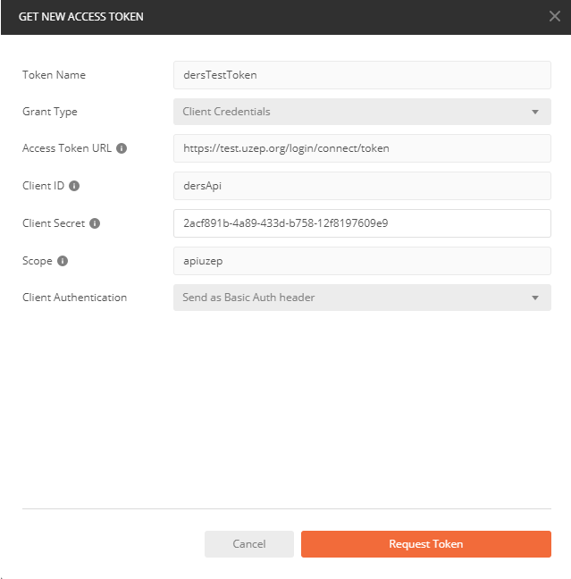
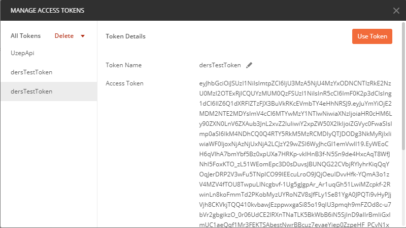
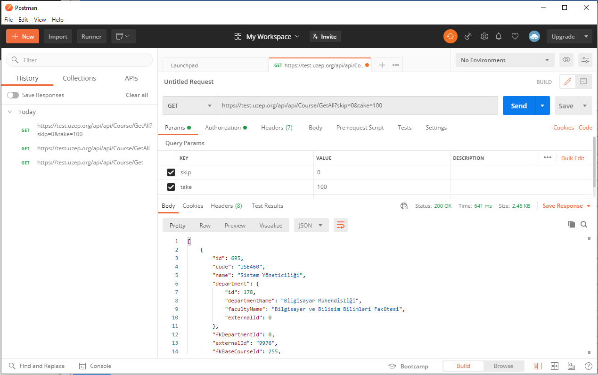

# API kullanarak entegrasyon veya veri yedekleme

Uygulama Programı Arayüzü (API) kullanarak UZEP içine veri yüklemek veya veri çekmek, yedekleme yapmak mümkündür. Bu işlemleri yapmak için istemci yazılımlar veya betikler (script) geliştirilebilir. İstemci yazılımların veya betiklerin geliştirilmesi kullanıcı üniversitelere bırakılmıştır. UZEP token (jeton) bazlı yetkilendirme (authorization) yapısı kullanmaktadır, bu nedenle geliştirceğiniz istemci yazılımlarının öncelikle UZEP'e tanımlanması (yetkilendirilmesi) gerekmektedir. Yetkilendirme sadece **Süper Yönetici** rolündeki bir kullanıcı tarafından yapılabilir.

**API kullanım işlem basamakları:**
1. İstemci tanımlama (yetkilendirme) işlemleri.
2. Mevcut API'lerin görülmesi, işlevleri ve tanımlarının incelenmesi.
3. API'lerin kullanımı.

## 1. İstemci yetkilendirme (client authorization) için aşağıdaki işlemler yapılır:
1. Süper yönetici rolündeki kişiler, UZEP ana menüsünde yer alan "Ayarlar" sekmesini tıkladığında, açılan sayfada API işlemleri kısmında **Client Tanımlama** ve **Swagger** butonları bulunmaktadır (Bkz. Şekil 1). **Client Tanımlama** butonu tıklanır, açılan arayüzde girilmesi gereken bilgiler şunlardır:
* **İstemci ID:** Harflerden oluşan ayırdedici bir kelime olmalıdır. Aynı ID ile iki istemci ID olamaz ve Türkçe karakter kullanılmamalıdır. 
* **İstemci adı:** Geliştirdiğiniz uygulamanın adı veya kullanım amacınıza uygun bir ad olabilir. Birkaç kelimeden oluşabilir, Türkçe karakter kullanılabilir.
* **Secret:** Gizli kelime, bilgilerin belirli bir algoritma ile şifrelenmesi için kullanılır. UZEP otomatik bir secet üretir, istenildiğinde değiştirebilir.
* **Token son geçerlilik tarihi:** Boş bırakılırsa sonsuz süreli token verilmiş olur. Güvenlik için kısa süreli tercih edilmelidir.  
2. **Ekle** butonu tıklanarak yeni API istemcisi UZEP'e tanıtılmış olur (Bkz. Şekil 2). 
3. API istemci tanımlama sayfasından, mevcut istemciler güncellenebilir, silinebilir veya yeniden tanımlanabilir.

  

Şekil 1. API işlemleri seçimi: Sayfanın alt tarafındaki butonlardan "İstemci Tanımlama" ve "API tanımlama" (Swagger) arayüzlerine geçiş yapılabilir. 
  

  

Şekil 2. Yeni API istemcisi tanımlama arayüzü. 
  

## 2. UZEP'te var olan API'ler ve tanımları: 
1. Süper yönetici rolündeki kişiler, UZEP ana menüsünde yer alan "Ayarlar" sekmesini tıkladığında, açılan sayfada API işlemleri kısmında **Client Tanımlama** ve **Swagger** butonları bulunmaktadır (Bkz. Şekil 1). Buradaki **Swagger** butonu tıklanır. 
2. Açılan sayfada ilk anda tüm API'ler, veri transfer metotları (GET veya POST) ve erişim URL'leri görülmektedir. API'ler "Baz Dersler: BaseCourse", "Dersler: Course", "Ders Kullanıcıları: CourseUser", "Takvim: Schedule", "Kullanıcılar: User", "Video" ve "Web bağlantısı: WebHookReceiver" şeklinde sınıflandırılmıştır (Bkz. Şekil 3).
3. Herhangi bir API üzerine tıklandığında parametre isimleri ve tipleri görülebilir. API'nin aktif olup olmadığı "Try it out" butonu tıklanarak görülebilir (bu buton sadece test içindir, veri getir/götür yapmaz).
4. Sayfanın alt tarafında şemalar kısmı bulunmaktadır. Buradan UZEP'te saklanacak veya getirilecek verilerin veritabanındaki tiplerini incelemek mümkündür.

  

Şekil 3. UZEP API'lerinin detayları. 
  

## 3. UZEP'te var olan API'lerin örnek kullanımı: 
UZEP API örneklerini anlatmak için [Postman Platformu](https://www.postman.com/) kullanılmıştır. Postman ile hızlıca istemci işlevleri taklit edilebilir, REST istekleri UZEP sunucusuna gönderilebilir ve sonuçlar JSON formatında elde edilebilir. Bu şekilde entegrasyon yapılabilir veya veritabanı yedekleme işlemleri yapılabilir.  

**Not:** Güvenlik açısından **Postman web** arayüzünden erişim UZEP tarafında yasaklanmıştır. Bu nedenle **Postman masaüstü** uygulamasını indirmeniz gerekecektir.  

UZEP veritabanında var olan derslerin yedeklenmesi için örnek bir uygulama oluşturulmak istensin. İlk işlem, Şekil 4.'te gösterildiği gibi UZEP tarafında istemcinin oluşturulmasıdır. Daha sonra Postman uygulaması üzerinden token elde ederken burada girilen **Client ID**, ve **Secret** bilgilerine  ihtiyaç olacaktır. **Not:** "ClientId" ve "Secret" asla bir yerlerde yazılı bırakılmamalı ve başka kişilerle paylaşılmamalıdır. 

  

Şekil 4. UZEP tarafında örnek istemcinin oluşturulması. 
  

**Postman masaüstü ile API'lerin test edilmesi:**
1. [Postman](https://www.postman.com/downloads/) web sitesinden masaüstü uygulama indirilir.
2. Postman istemci üzerinde hesap oluşturulur ve giriş yapılır.
3. Sayfanın ortasındaki menüden "Authorization" şeçilir. **TYPE** olarak "OAuth 2.0" ve **Add Authorization data to** "Request Headers" olarak seçilir. 
4. Sağ tarafta "Get New Access Token" butonu tıklanır (Bkz. Şekil 5). Açılan pencereye aşağıdaki değerler girilir:
* **Token Name:** Token için herhangi bir isim verebilirsniz. Biz bu örnekte "dersTestToken" ismini verdik.
* **Grant Type:** "Client Credentials" seçilmelidir.
* **Access Token URL:** Üniversitenizdeki UZEP url adı sonuna "/login/connect/token" girilmeldir. Bu örnek uyglamada "https://test.uzep.org" üzerinde çalıştığımız için https://test.uzep.org/login/connect/token" girildi. 
* **Client ID:** UZEP tarafında client oluştururken verilen isim buraya girilmelidir. Bu örnekte daha önce oluşturulan "dersApi" adlı istemci ID'si girilmiştir.
* **Client Secret:** UZEP tarafında client oluştururken girilen secret buraya girilmelidir. Bu örnekte "2acf891b-4a89-433d-b758-12f8197609e9" secret kullanılmıştır, UZEP'te oluşturulan ile aynı olmalıdır.
* **Client Autehentication:** "Send as Basic Auth header" seçilmelidir (Bkz. Şekil 6).

  

Şekil 5. Token isteğinin başlatılması. 
  

  

Şekil 6. Token isteği için girilen bilgiler. 
  

5. İstek sonucu gelen token ekranda görülür, "Use Token" butonu tıklanarak devamında yapılacak API istekleri için bu token kullanılabilir (Bkz. Şekil 7). **Token asla paylaşılmamalıdır.**
  

Şekil 7. İstek sonucu UZEP tarafından döndürülen "Token" **Asla paylaşılmamalıdır**. 
  

6. Token elde edildikten sonra API'ler çalıştırılabilir. Bunun için Postman masaüstü uygulamasında orta yerde görünen pencerede API metodu seçilir (Örneğin GET veya POST gibi). 
7. "Enter request URL" yazan yere "https://test.uzep.org/api/api/Course/GetAll" girin. Başka bir API kullanılacaksa, Süper yönetici rolünde iken "UZEP" --> "Ayarlar" kısmından, "Api işlemleri" satırında "Swagger" tıklanarak uygun API seçilmelidir. Örneğin Sakarya Üniversitesi için tüm baz dersleri getiren URL "https://uzep.sakarya.edu.tr/api/api/BaseCourse/GetAll" şeklinde olacaktır.
8. Çağrı parametresi olarak KEY kısmına "skip" VALUE kısmına 0 girin. Diğer bir parametre olarak KEY kısmına "take" VALUE kısmına da 100 girin. Girilen skip ve take parametreleri ile yapılan çağrı sonucunda, veritabanındaki verilerin başlangıç kısmından hiç atlanmadan en fazla 100 adet sonuç döndürülecektir (Bkz. Şekil 8). 

  

Şekil 8. "/api/Course/GetAll" API çağrısı ile derslerin JSON formatında getirilmesi. 
  