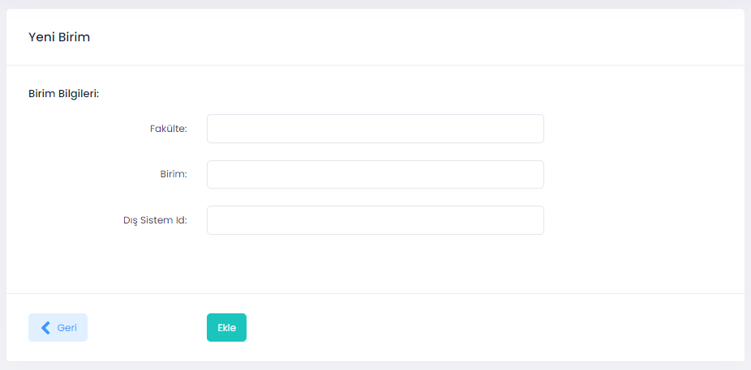

# UZEP'e birim/bölüm eklemek

Yönetici rolüne sahip kişiler aşağıdaki adımları takip ederek UZEP'e birim (Fakülte, Bölüm veya Program) ekleyebilir, silebilir veya kayıtları düzenleyebilir. 

**İşlemler (Aşağıdaki işlemleri sadece yönetici rolünde olanlar yapabilir):**
1. Menüden **Birimler** seçilir.
2. Sağ üst köşedeki **Yeni Birim** butonu tıklanır.
3. Açılan pencerde:
- **Fakülte** (Fakülte, MYO veya Enstitü adı. String yapısında olup ayırdedici olmalı),
- **Birim** (Bölüm veya program adı olabilir),
- **Dış Sistem Id** (Tamsayı) bilgileri girilir ve **Ekle** butonuna basılır.
Birim UZEP'e eklenmiştir.

Şekil 1. Yeni birim ekleme ekranı. 
