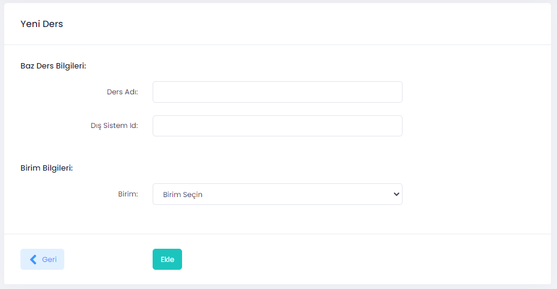
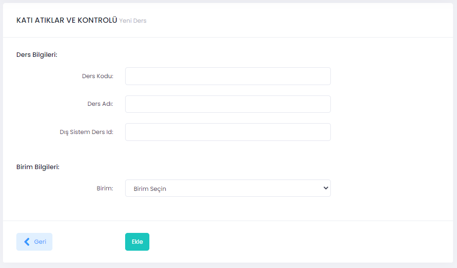

# Ders ekleme/silme, kayıt düzenleme

Yönetici rolüne sahip kişiler aşağıdaki adımları takip ederek UZEP'e baz ders ve şube ders ekleyebilir, silebilir veya kayıtları düzenleyebilir. 

**İşlemler (Aşağıdaki işlemleri sadece yönetici rolünde olanlar yapabilir):**
1. Menüden **Dersler** seçilir.
2. Sağ üst köşedeki **Yeni Baz Ders** butonu tıklanır.
3. Açılan pencerde:
- **Ders Adı**,
- **Dış Sistem Id**,
- **Birim** bilgileri girilir ve **Ekle** butonuna basılır.

Baz ders UZEP'e eklenmiştir. Ders kayıtlarnı düzenlemek için **Dersler** arayüzünde iken ilgili dersin sağ tarafında "Düzenle" simgesi tıklanır.

Şekil 1. Yeni baz ders ekleme ekranı. 

Baz dersin altına şube ders eklemek için baz derslerin görüldüğü sayfada sağ tarafta "Alt Dersler" simgesi tıklanır, açılan sayfada **Alt Dersler** tanımlanır.

**İşlemler (Aşağıdaki işlemleri sadece yönetici rolünde olanlar yapabilir):**
1. Baz derslerin görüldüğü sayfada sağ tarafta "Alt Dersler" simgesi tıklanır.
2. Açılan sayfada sağ üst köşedeki **Yeni Ders** butonu tıklanır.
3. Açılan pencerde:
- **Ders Kodu**,
- **Ders Adı**,
- **Dış Sistem Ders Id**,
- **Birim** bilgileri girilir ve **Ekle** butonuna basılır.

Şekil 2. "Katı Atıklar ve Kontrolü" baz dersine yeni alt ders ekleme ekranı. 
