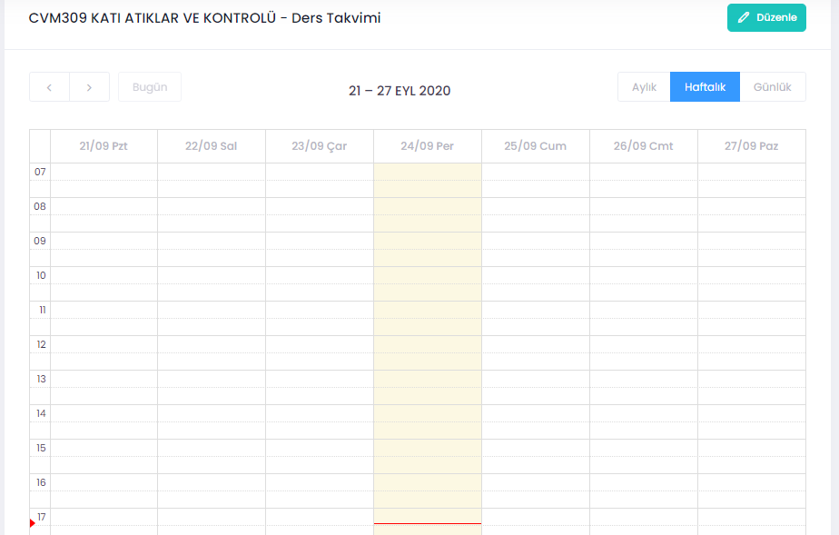

Yönetici rolüne sahip kişiler aşağıdaki adımları takip ederek bir alt dersin **Takvim**ini girebilir veya düzenleyebilir. 

**İşlemler (Aşağıdaki işlemleri sadece yönetici rolünde olanlar yapabilir):**
1. Alt derslerin görüldüğü sayfada sağ tarafta “Takvim” simgesi tıklanır.
2. Açılan sayfada uygun zaman aralığı seçilir.

Ders için **Takvim** oluşturulmuştur. Tekrarlı aktiviteler için takvim üzerinde ileri tarihli saat aralıkları seçilmelidir.

Şekil 1. Ders için takvim düzenleme. 

Şekil 2. Saat aralığı belirleme ekranı. 
