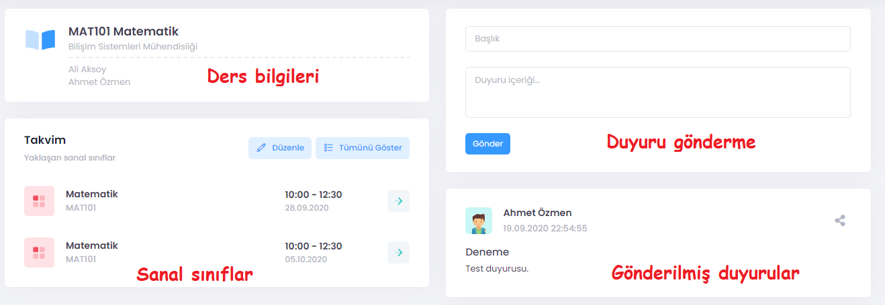

# Dersler

Bir derse ait sayfada dört bölüm bulunur: 
**1. Ders bilgileri:** Dersin kodu, adı, öğretim elemanları. 
**2. Takvim:** Bu bölümde tanımlı sanal sınıflar görülmektedir. İstenildiğinde bu bölümdeki butonlar kullanılarak yeni sanal sınıf tanımlanabilir veya düzenlenebilir.  
**3. Duyuru gönderme:** Seçilmiş olan dersin katılımcılarına mesaj göndermek için kullanılan kısımdır. Her mesajın bir başlığı ve bir de gövdesi girilebilir. 
**4. Daha önce gönderilmiş duyurular:** Duyuru gönderme arayüzünün hemen alt tarafında, bu ders ile ilgili daha önce gönderilmiş duyurular görülebilir.  

  

