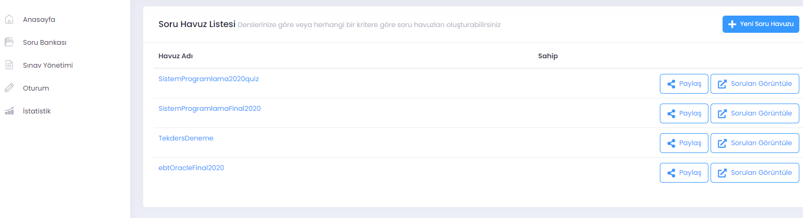
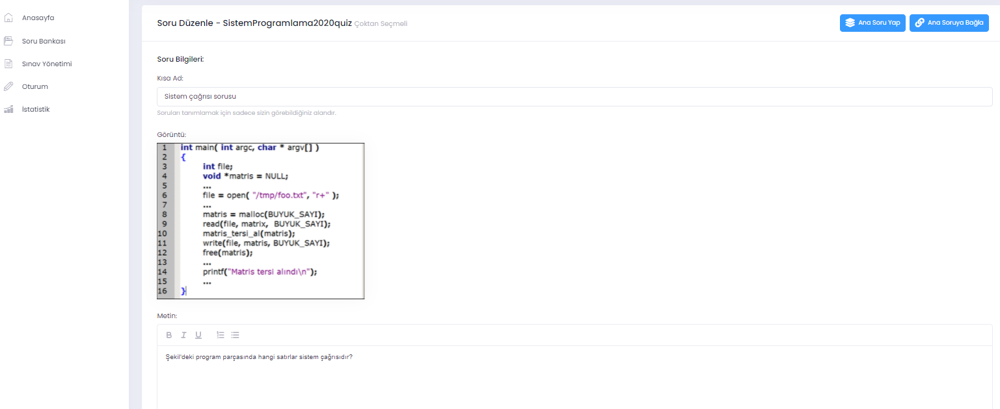
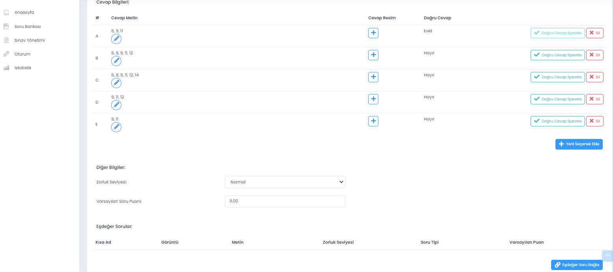

# E-Sınav Modülü
Ölçme değerlendirme faaliyetlerini uzaktan yürütmek üzere E-sınav modülü geliştirilmiştir. E-sınav modülü içinde erişim denetimi, soru hazırlama, sınav oluşturma, soru girişi, sınav yönetme, oturum izleme, loglama gibi çok sayıda bölümlerden oluşmaktadır. E-sınav modülüne giriş kullanıcı adı ve şifre ile yapılmaktadır, öğretim elemanları ve öğrenciler kendilerine verilen kullanıcı adı ve şifrelerle sisteme girerler ve yetkileri dahilinde işlemler yaparlar.

<!--img src="assets/images/esinavLogin.png"/-->

## Soru hazırlama:
Bir sınavın sorularını sisteme girmek için "Soru Bankası" içinde bir "Soru Havuzu" oluşturulması gerekir. Soru bankası içinde geçmişte hazırlanmış sınav soruları görülebilir, yeni bir havuz oluşturulabilir. Oluşturulan bir soru havuzu başka öğretim elemanları ile paylaşılabilir. Bu şekilde çok sayıda öğretim elemanı kollektiv olarak sınav sorularını siteme girebilir. Bazı sorular bir ortak metne dayalı olabilir, E-sınav modülü bu tarz soruların da oluşturulmasına imkan tanımaktadır.

Sorular sisteme girilirken hem ana metinde ve hem de şıklarda resim, metin olabilir. Sorular için kısa isimlendirme yapılabilir, zorluk durumuna göre etiketlendirilebilir. Ayrıca sınavda çıkacak bir soru için eşdeğer sorular oluşturulabilir. Her soru için farklı puanlama yapılabilir. Sınav sırasında soruların ve şıkların her öğrenciye farklı düzende gelmesi sağlanabilir. Eşdeğer soru grupları ile öğrencilere farklı sorular çıkması da sağlanabilir.

Bir sınav için hazırlanacak soruların sayısında bir kısıt yoktur. Öğretim elemanları dilerdiği zamanda sorularını hazırlayabilir, sisteme girdikleri zaman da sınav yürütülebilir. Örneğin, canlı yayın ders sırasında, ara verildiğinde istenirse bir kısa sınav yapılabilir. Bunun için ders başlamadan önce soru bankasında bir sınav oluşturulması ve sınav başlama saati uygın şekilde sisteme işlenmesi gerekir.

### Soru türleri
E-sınav modülü üzerinde 1) Çoktan seçmeli, 2) Doğru yanlış, 3) Ucu açık sorular hazırlanabilir. Bir sınavda soruların tamamı aynı türde olabileceği gibi karışık düzende de oluşturulabilir. Örneğin 20 soruluk bir sınavda 5 soru doğru-yanlış, 5 soru ucu-açık, kalan 10 soru da çoktan seçmeli olarak organize edilebilir.

### Eşdeğer sorular:
Çevrimiçi sınavlarda sınavdan erken çıkan öğrencilerin soruları paylaşması sınav güvenliğini zedelemektedir. Öğretim elemanları bu durumlar için isterlerse sınavdaki bir soru için çok sayıda eşdeğer sorular hazırlayarak öğrencilere farklı soruların gelmesi sağlanabilir. Bunun için, herhangi bir soru sisteme girildiğinde eşedeğer soru olarak değerlendirilecekse, eşdeğer soru grubu belirtilmelidir. Her sınav sorusu farklı sayıda eşdeğer soru barındırabilir.   

## Sınavların yürütülmesi:
Sınav soruları sisteme girildiğinde aktif olabilmesi için sınav tarihi ve saati girilerek onaylanması gerekir. Onaylanmamış sınavlar öğrenci arayüzünde görülmezler. Öğretim elemanları hazırladıkları sınavları onaylamayı unutmamalıdır. Sınav süresi ve oturum süresi farklı olarak tanımlanabilir. Örneğin, 90 dakikalık bir sınav için oturum süresi 120 dakika ayarlanabilir. Oturum süresi sınav süresinden kısa olamaz. Oturum süresini, sınav süresinden 5-10 dakika daha uzun belirlemek iyi bir pratiktir. Öğrenciler bazen sisteme girerken sorunyaşayabilir, böyle bir durumda mağdur olmamış olurlar. Oturum süresinin çok uzun belirlenmesi ise sınavdan erken çıkan öğrencilerin sınav sorularını farklı ortamlarda paylaşmasına neden olabilmektedir. SInav başladıktan sonra öğrencilerin sınav oturumları sistem üzerinden izlenebilir.

### Oturumların izlenmesi:
	
### "Ek süre" veya "Sınav hakkı" verme:

## Sınav mazereti:
