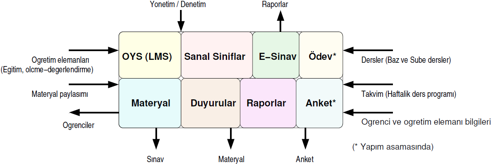

# Uzaktan Eğitim Platformu

Tübitak tarafından desteklenen proje ile ülke çapında tüm yükseköğretim kurumlarının istifade edeceği bir uzaktan eğitim platformu geliştirilmesi planlanmıştır (Proje no: 120K200). Sistemin donanım alt yapısı ULAKBİM tarafından sağlanırken, yazılım komponentleri Sakarya Üniversitesi tarafından geliştirilmektedir. Geliştirilen sistem üniversitelerin bilişim kaynaklarına ihtiyaç duymadığından, herhangi bir yükseköğretim kurumu için çok kısa sürede hizmete alınabilmektedir.  

### Projenin temel hedefleri:  
1. Yüksek performans ve Internet band genişliği isteyen servisler için bilişim kaynaklarının yükseköğretim kurumları arasında paylaşımı yoluyla maliyetlerin azaltılması.  
2. Kişisel Verilerin Korunması Kanunu (KVKK) ile uyumlu olması.  
3. Salgın veya doğal afet durumlarında yükseköğretim kurumlarında eğitimin sürekliliğinin sağlanması. 

Geliştirilen sistemin modeli **"Servis olarak Eğitim"** _(Education as a Service: EaaS)_ şeklinde bir bulut hizmeti olarak tanımlanabilir.

## Sistemin bileşenleri:
**1. [Öğrenme Yönetim Sistemi (ÖYS) Modülü](/oys.html):** Haftalık sanal ders programlarının oluşturulmasını, uzaktan yürütülen eğitim faaliyetlerinin organize edilmesini ve yürütülmesini sağlayan modül. 
**2. [Sanal Sınıf Modülü](/sanal.html):** Sanal sınıfların video dağıtımını sağlayan ve açık kaynak yazılımlardan yararlanılarak oluşturulmuş modül. 
**3. [Duyuru Modülü](/duyuru.html):** Öğrencilere çeşitli düzeylerde duyuru yapılabilmesini sağlayan modül. 
**4. [Çevrimiçi Sınav Modülü](/esinav.html):** Çoktan seçmeli, ucu açık, doğru yanlış tarzda soruların hazırlanabileceği ve sınavların yürütülebileceği modül. 
**5. [Raporlama Modülü](/rapor.html):** Öğrenci devamı, akademisyen/sanal ders yürütülme sayıları gibi raporların sistem üzerinden alınabildiği modül. 

<!-- Yakın zamanda sisteme **Ödev Modülü** de ilave edilecektir. --> 

## Proje çalışanları:
<table style="width:100%">
  <tr>
    <td></td>
    <td style="text-align:left; vertical-align:top"><b><a href="http://ozmen.sakarya.edu.tr/">Ahmet Özmen</a> (Proje yürütücüsü):</b>  Sistemin tasarımı ve proje yönetim faaliyetlerinden sorumlu.  Mail: <a href="mailto:ozmen@sakarya.edu.tr">ozmen@sakarya.edu.tr</a> Tel: (264) 295 7350</td>
  </tr>
   <tr>
    <td></td>
    <td style="text-align:left; vertical-align:top"><b><a href="http://mhorzum.sakarya.edu.tr/">Mehmet Barış Horzum</a> (Araştırmacı):</b>  Sistemin eğitim süreçleri ile uyumu ve geliştirme çalışmalarından sorumlu.  Mail: <a href="mailto:mhorzum@sakarya.edu.tr">mhorzum@sakarya.edu.tr</a> Tel: (264) 295 5141</td>
  </tr>
  <tr>
    <td></td>
    <td style="text-align:left; vertical-align:top"><b><a href="http://kaynak.sakarya.edu.tr/">Baran Kaynak</a> (Bursiyer - DevOps uzmanı):</b>  ÖYS ve sınav modülleri ile sistemin tasarımı, kodlanması ve test süreçlerinden sorumlu.</td>
  </tr>
  <tr>
    <td></td>
    <td style="text-align:left; vertical-align:top"><b><a href="http://uozbek.sakarya.edu.tr/">Uğur Özbek</a> (Bursiyer - Video streaming uzmanı):</b>  Sanal sınıfların oluşturulması, video dağıtımı ve yük dengeleme süreçlerinden sorumlu.</td>
  </tr>
  <tr>
    <td></td>
    <td style="text-align:left; vertical-align:top"><b><a href="http://osmantuna.sakarya.edu.tr/">Osman Tuna</a> (Bursiyer - Full-stack uzmanı):</b>  Tüm modüllerin entegrasyonu ve kullanıcı arayüzlerinden sorumlu.</td>
  </tr>
  <tr>
    <td></td>
    <td style="text-align:left; vertical-align:top"><b><a href="http://aliaksoy.sakarya.edu.tr/">Ali Aksoy</a> (Bursiyer - Full-stack uzmanı):</b>  Sanal sınıf entegrasyonu ve ÖYS arayüzlerinden sorumlu.</td>
  </tr>
  <tr>
    <td></td>
    <td style="text-align:left; vertical-align:top"><b><a href="http://bgol.sakarya.edu.tr/">Burak Göl</a> (Bursiyer - Dokümantasyon):</b>  Kullanım kılavuzu ve yardım dokümanlarının hazırlanmasından sorumlu.</td>
  </tr>
 </table>
