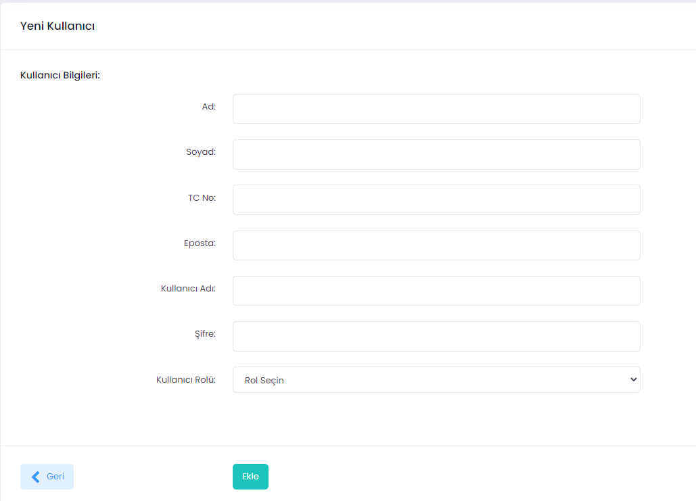

# Kullanıcı ekleme/silme, kayıt düzenleme

Yönetici rolüne sahip kişiler aşağıdaki adımları takip ederek UZEP'e kullanıcı ekleyebilir, silebilir veya kayıtları düzenleyebilir. Daha önce tanımlanmış bir kullanıcının **Kullanıcı Adı** üzerinde değişiklik yapılamaz, değişiklik yapılması gerektiği durumlarda mevcut kullanıcı silinip, yeni kullanıcı açılabilir.

**İşlemler (Aşağıdaki işlemleri sadece yönetici rolünde olanlar yapabilir):**
1. Menüden **Kullanıcılar** seçilir.
2. Sağ üst köşedeki **Yeni Kullanıcı** butonu tıklanır.
3. Açılan pencerde:
- Ad,
- Soyad,
- TC No,
- Eposta,
- Kullanıcı adı,
- Geçici şifre,
- Rol bilgileri girilir ve **Ekle** butonuna basılır.

Kullanıcı UZEP'e eklenmiştir.

Şekil 1. Yeni kullanıcı ekleme ekranı. 
