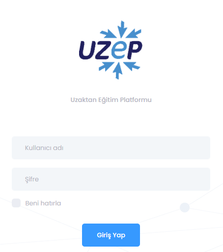
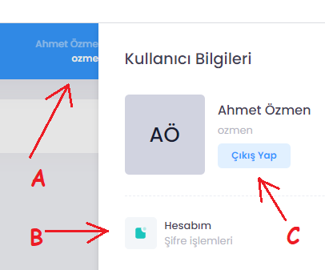
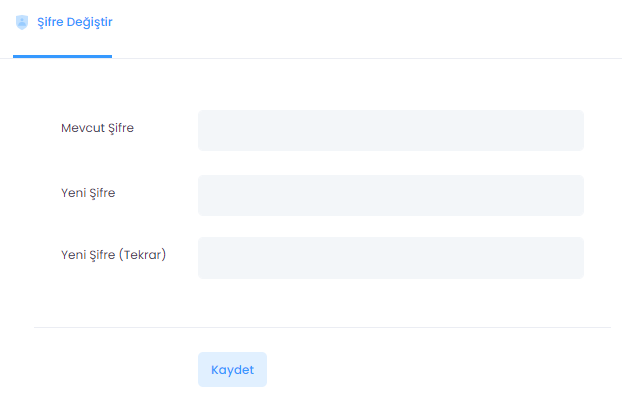

# UZEP Login / Logout

UZEP'e sıkça kullanılan Chrome, Firefox, Opera, Safari gibi web tarayıcıları ile girilebilir. UZEP'e cep telefonlarındaki tarayıcılardan da girilebilir. Ayrıca E-devlet entegrasyonu yapıldıysa, E-devlet arayüzünden de giriş yapılabilir.  

 

Şekil 1. UZEP login sayfası. 

1. Web tarayıcısı adres çubuğuna _https://uzep.\*.edu.tr_ yazılır. '\*' yerine üniversitenin alan adını tamamlayıcı kelime yazılmalıdır, örneğin "Sakarya Üniversitesi" için _"https://uzep.sakarya.edu.tr"_ gibi.
2. Açılan sayfada **Kullanıcı adı** yerine tanımlı kullanıcı adı girilir. Genel olarak üniversite bilgi sistemine kayıtlı kullanıcı adı UZEP için de tanımlanmaktadır. Kullanıcı adı büyük/küçük harf duyarlıdır.
3. **Şifre** penceresine tanımlı şifrenizi girebilirsiniz Sistem tarafından tanımlı şifreler ilk girişte değiştirilmelidir.
4. **Giriş Yap** butonuna basılarak giriş yapılır.
5. **Şifre değişikliği** için açılan sayafada sağ üst köşede isminizi barındıran ikon tıklanır. **Hesabım** tıklanır ve açılan pencerede şifre değişikliği yapılır (Bkz. **Şekil 2 ve Şekil 3**).
6. UZEP'ten çıkış için sağ üst köşedeki isminizi barındıran ikon tıklanır, açılan pencerede **Çıkış Yap** butonu tıklanarak sistemden çıkılır (Bkz.  **Şekil 2**).  

Şekil 2. Şifre değişikliği veya çıkış işlemi. 

Şekil 3. Şifre değişikliği penceresi. 

