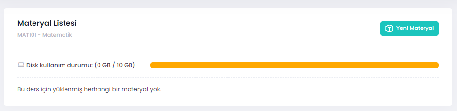
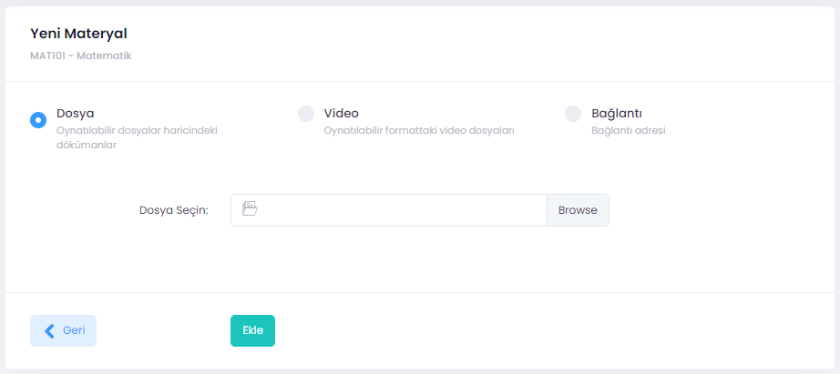

# Materyal Paylaşımı

1. Sisteme yüklenenecek doküman yerel makinada (bilgisayar, cep telefonu veya tablet olabilir) hazır edilir. Hazırlanan dokümanın biçiminin önemi yoktur. 
2. Sistem üzerinde yüklenebilecek doküman boyutu ile kısıtlar bulunmaktadır. Mevcut durumda bu kısıtlar aşağıdaki tabloda verilmiştir.
3. Ana sayfada menü üzerinden **Dersler** seçilir.
4. Panelde materyal eklemek istenen ders seçilir (Örneğin Mat101 Matematik).
5. Menüden **Materyal** seçilir.
6. Panelden **Yeni Materyal** seçilir.
7. Açılan pencerede materyal türü (dosya, video veya link) seçilir.
8. **Browse** tıklanarak yüklenmek istenen dosya bulunur ve tıklanır.
9. Arayüz üzerindeki **Ekle** butonu tıklanır.
10. Yükleme işlemi tamamlanmıştır, derse kayıtlı tüm öğrenciler yüklenen dokümanlara erişebilir.

**Not:** Belirlenen boyutlardan daha büyük dosyalar için yerel dosya sunucuları kullanılabilir, bu durumda dosyanın linki paylaşılabilir.

Tablo 1. Hafta ve dönem için en fazla materyal boyutları. 

|Periyot | Doküman Boyutu |
| :---|:---|
| Hafta | 500 MB |
| Dönem | 10 GB |

 

Şekil 1. Materyal ekleme. 

Şekil 2. Materyal seçimi ve yükleme arayüzü. 
