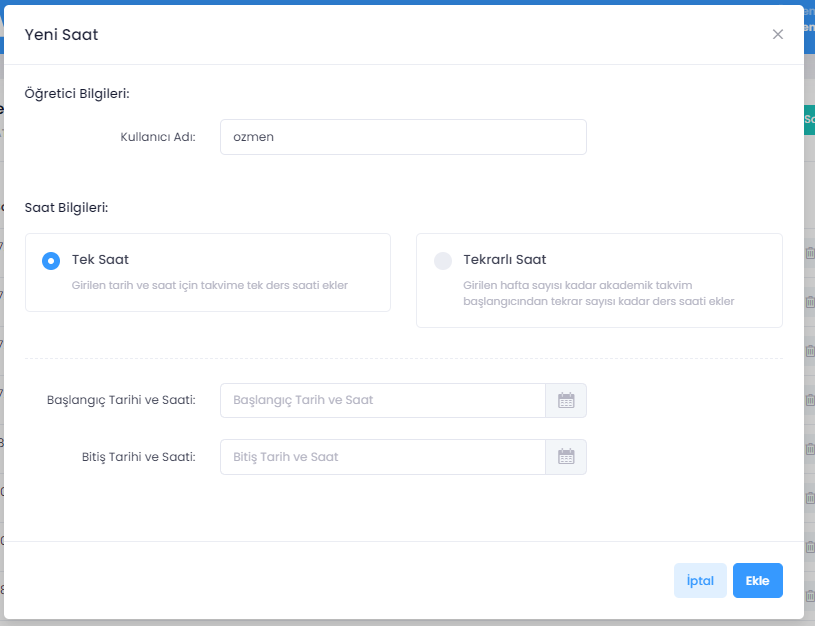
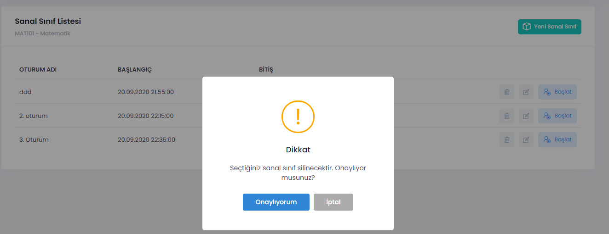

# Sanal Sınıf Oluşturma, Silme ve Düzenleme

Yöneticiler dönem başında öğretim elemanlarının tüm derslerinin haftalık programlarını UZEP - Takvime veri aktarma yoluyla girerler. Öğretim elemanı UZEP'e girdiğinde **Takvim**de kendi derslerinin programını aylık/haftalık veya günlük ölçekte görür (Bkz. [Takvim](/takvim.html)). Zamanı yaklaşan sanal sınıflar takvime bağlı olarak öğretim elemanı tarafından oluşturulur ve vakti geldiğinde yürütülür. Eğer öğretim elemanı sanal sınıf oluşturmazsa veya oluşturmayı unutursa planlanan saatte canlı ders yapılamaz, öğrenciler derse katılamaz. O nedenle **Takvim**de tanımlı haftalık programa uygun sanal sınıf mutlaka öğretim elemanı tarafından belirlenen saaten önce oluşturulmalıdır.  

**Sanal sınıf oluşturma adımları:** 
1. Ana sayfada menü üzerinden **Dersler** seçilir. 
2. Panelde sanal sınıf eklemek istenen ders seçilir (Örneğin Mat101 Matematik). 
3. Menüden **Sanal Sınıf** seçilir. 
4. Açılan pencerede sağ üst köşede **Yeni Sanal Sınıf** butonu tıklanır.  
5. **Ders Tarihi** olarak **Takvim**de dönem başında yöneticiler tarafından tanımlanmış tarih ve saat ikilisinden uygun olanı seçilir (sanal sınıf ile ilişkilendirilir). Aynı tarih ve saat için birden fazla sanal sınıf tanımlanabilir. **Takvim**inde tanımlı program olmayan öğretim elemanları sanal sınıf oluşturamaz. Bu bakımdan dönem başında UZEP'e girilen haftalık ders programları bir dönem için kusursuz olmalıdır.  
6. **Oturum Adı** olarak sanal sınıfa bir isim verilir. Örneğin **1. Hafta sanal sınıf** gibi. 
7. **Başlangıç Tarihi** ilişkilendirilen **Takvim** programından otomatik getirilir. Arzu edilmez ama istenildiğinde veya gerektiğinde bu tarih/saat değiştirilebilir. 
8. **Süre** dakika olarak girilir. Örneğin, üniversite tarafından **1 saatlik örgün ders için 30 dakika yapılır** kararı alındıysa ve 3 saatlik bir ders için işlem yapılıyorsa, buraya 90 girilir. 
9. **Ekle** butonuna basılarak sanal sınıf oluşturulur. 
10. Sanal sınıf oluşturduktan sonra tekrar bir önceki sayfaya dönülür. Bu sayfada ayrıca daha önceden açılmış ve sürdürülebilecek sanal sınıflar görülür. **Başlat** butonu tıklanarak yeni açılan veya daha önce tanımlanmış ve henüz oturumu sona ermemiş sanal sınıf başlatılabilir.  
11. Aynı sayfada daha önce oturumu sona ermiş sanal sınıflar izlenebilir. 
12. Öğretim elemanı anlık olarak sadece bir sanal sınıf başlatabilir, yürütebilir. Başlatılmış ve devam eden bir oturum varsa sistem uyarı vererek yeni sanal sınıfı başlatmayacaktır.  

 

Şekil 1. Sanal sınıf ekleme arayüzü. 

**Sanal sınıfı silme:** 
1. Ana sayfada menü üzerinden **Dersler** seçilir. 
2. Panelde sanal sınıf eklenmek istenen ders seçilir (Örneğin Mat101 Matematik). 
3. Menüden **Sanal Sınıf** seçilir. 
4. Silinecek sanal sınıf seçilerek **SİL** ikonu tıklanır. 
5. **Silinen bir sanal sınıf geri alınamaz.** Bu bakımdan sanal sınıf silinirken çok dikkatli olunmalıdır.  
6. Silinen bir sınıf **Takvim**i etkilemez, ilişkili tüm sanal sınıflar silinse bile **Takvim**de tanımlı faaliyet silinmez. 

    

Şekil 2. Sanal sınıf silme arayüzü. 

**Sanal sınıf tarihini veya zamanını değiştirme:**  
1. Ana sayfada menü üzerinden **Dersler** seçilir.
2. Panelde sanal sınıf eklemek istenen ders seçilir (Örneğin Mat101 Matematik).
3. Menüden **Sanal Sınıf** seçilir.
4. Düzenleme sanal sınıf seçilerek **EDIT** ikonu tıklanır. 
5. Değişiklikler yapılır ve kaydedilir. 

