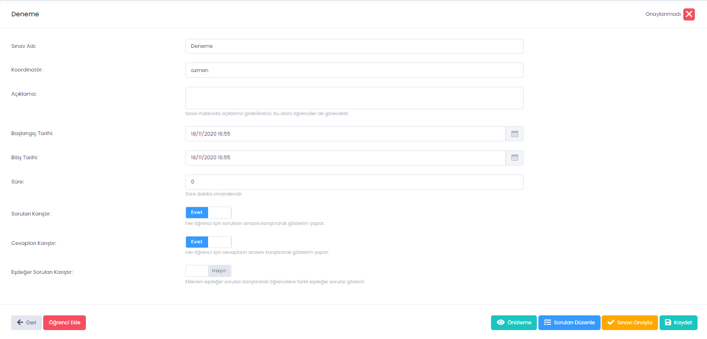

# UZEP Sınav Modülü

Öğrenciler için hazırlanmış pdf **UZEP Sınav Kılavuzu** için [tıklayınız.](assets/files/pdf/UZEPSinavOgrenci.pdf) 

UZEP üzerinde çevrimiçi sınavlar hazırlanıp uygulanabilir. UZEP-Sınav modülü ile şu tip sorular sorulabilir: 1) Çoktan seçmeli sorular, 2) Açık uçlu sorular, 3) Doğru/Yanlış. Bu sorular sınav içinde karma şeklinde sorulabilir. Açık uçlu sorulara cevaplar sadece metin şeklinde olabilir, içinde formül barındıran hesaplamalar için bu yöntem uygun olmayabilir. Sınav hazırlığı sırasında:
- En az ihtiyaç kadar soru önceden hazırlanıp soru bankasına/havuzuna konulmalıdır. Soru bankası öğretim elemanları arasında paylaşılabilir. Çok sayıda öğretim elemanı bir soru havuzuna soru girebilir. Açık uçlu sorular koordinatör veya soruyu giren öğretim elemanı tarafından değerlendirilebilir.
- Ana metine/resime bağlı sorular oluşturulabilir.
- Soru bankası içinde eşdeğer soru kümeleri oluşturulabilir. Eşdeğer soru kümesindeki sorular öğrencilere rastgele seçilerek sorulur.
- Sorular hazırlandıktan sonra, sınav oluşturma safhasına geçilir. Sınav oluşturulurken soru bankasındaki sorular sınav ile ilişkilendirilir.
- Ders öğretim elemanı tarafından onaylanan sınava, öğrenciler oturum zamanı gelince girilebilir.
- Sınavın hangi zaman aralığında aktif olacağı ve ne kadar süreceği sınav oluşturma sırasında sistem üzerinden girilmelidir. Sınav oturum süresinin sınav süresinden uzun olması tavsiye edilir (şart değildir). Örneğin sınav süresi 30 dakika ise aralığı 40 dakika olabilir.

**Sınav oluşturma işlem basamakları:**

1. UZEP'e giriş yaptıktan sonra sınav yapılacak ders seçilir.
2. Menüden "Sınav" seçilir.
3. Sağ üst köşede "Yeni Sınav" tıklanır.
4. Açılan sayfada, sınava kısa bir ad verilir, sınavın başlangıç tarih ve saati girilir. Daha sonra altta görülen "Ekle" butonu tıklanır.
5. Oluşturulan sınav kaydı sayfada görülür, "Sınava Git" butonu tıklanarak sınav modülüne geçiş yapılır.
6. Daha önce oluşturulmuş sınavlar sağdaki "Sil" butonu ile bu sayfadan silinebilir.

**Sınav modülü**
Sınav modülüne geçince menü bandı koyu renk (siyah) olmaktadır. Sınav modülünde iken sol taraftaki menüden "Soru Bankası" veya "Sınav Yönetimi" işlemlerini yapabilmeniz mümkündür. 
1. **Soru bankası:**  Soru bankası soru havuzlarının bulunduğu yerdir. Bu sayfada iken yeni soru havuzu oluşturabilirsiniz, soru havuzunuzu başka öğretim üyeleri ile paylaşabilirsiniz veya soruları girebilirsiniz. 
2. **Sınav yönetimi:** Bu sayfada yeni sınav oluşturabilir, sınav organize edebilir, sınav sorularını düzenleyebilir, açık uçlu soruları değerlendirendirebilir veya sınav oturumlarını inceleyebilirsiniz. Bu sayfada onaylanmış sınavlar yeşil kutu ve OK işareti ile, onaylanmamış sınavlar ise kırmızı kutu ve X işareti ile görünür. Onaylanmamış bir sınava öğrenciler giremez; dolayısıyla, soru girişi tamamlandıktan ve kontrolleri yapıldıktan sonra sınav mutlaka onaylanmalıdır. Onaylama butonu bu sayfada görünen "Sınavı Düzenle" butonuna tıklanınca açılan sayfada, alt tarftadır (sarı buton).

**Sınav Düzenleme**
Sınav Düzenleme sayfasındaki bazı bilgiler (sınav adı ve sınav başlama tarihi ve saati gibi) UZEP ana sayfasından sınav oluşturulurken girilmektedir. Bu sayfada Şekil 1'de görülen diğer bilgiler girilmelidir. Yeni sınav oluşturulduğunda başlangıç ve bitiş tarihleri çakışık, süresi de 0 olarak gelmektedir. Burada düzenleme yapılarak oturum süresi ve sınav süresi dakika cinsinden girilmelidir. Öntanımlı olarak sorular ve şıkları herkese karışık gelecek şekilde ayarlıdır, istenirse bu değiştirlebilir. Ayrıca eşdeğer soruların da karışık gelmesi için sürgülü buton EVET'e çekilmelidir. Aşağıdaki butonlar vasıtasıyla sınav önizleme yapılabilir veya sorular düzenlenebilir. Soruları düzenleme seçildiğinde soru bankasındaki havuzlardan soru seçilebilir, puanlamalar ayarlanabilir. Sınavın tüm işlemleri tamamlandıysa (örneğin soru girişi ve diğer bilgilerin girişleri) "Sınavı Onayla" butonu tıklanmalıdır. Onaylama aşaması henüz gelmediyse yapılan değişiklikler kaydedilmelidir.

  

Şekil 1. Sınav düzenleme sayfası. 
  

Soru havuzu oluşturma ile ilgili video için [tıklayınız.](https://youtu.be/yil-z9KnY4E)

Çoktan seçmeli türünde soru eklemek ile ilgili video için [tıklayınız.](https://youtu.be/419ploeeiEg)

Doğru/Yanlış soru eklemek ile ilgili video için [tıklayınız.](https://youtu.be/KhmTQlD7Or4)

Açık uçlu soru türünde soru eklemek ile ilgili video için [tıklayınız.](https://youtu.be/HIAE81vrRzw)

Ana soru ile bağlantılı soru oluşturmak ile ilgili video için [tıklayınız.](https://youtu.be/iQHbqw--tR8)

Eşdeğer soru grubu oluşturmak ile ilgili video için [tıklayınız.](https://youtu.be/P83KU7H_6D4)

Yönetici yetkisinde olanların sınav oturumlarını incelemesi ile ilgili video için [tıklayınız.](https://www.youtube.com/watch?v=ekwOSwOxrwk&list=PLrX4FlRljtXNG8PJSkIdddhN466QjaXRW)

Not: Dersi veren öğretim elemanı bir öğrencinin sınav oturumunu incelemek isterse, yukarıdaki videonun 1:25 dakikasından sonrasını izlemesi yeterlidir.
<!--
Sınav oluşturma ile ilgili yardım videosu için [tıklayınız.](https://www.youtube.com/watch?v=niBI-gOsrZQ&list=PLrX4FlRljtXPSl5vKxTHrkxvteyBC003s&index=5)
-->