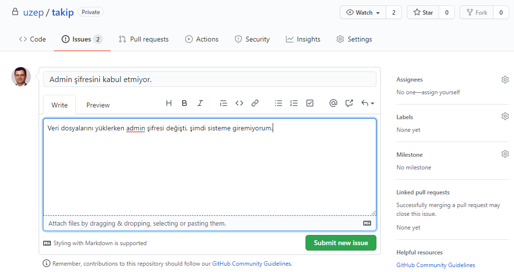
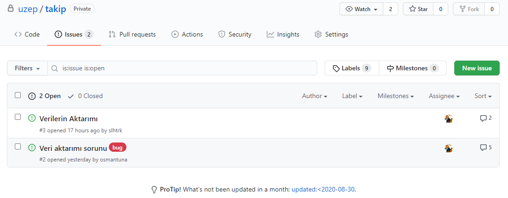

# UZEP Sıkça Sorulan Sorular

UZEP hakkında sıkçça sorulan sorular ve cevapları burada derlenmiştir.

**1. Sorun-bildir (issue-tracker) nasıl kullanılır?**

Sorun bildir sistemi github üzerinde yapılandırılmıştır. Sorun-bildir sisteme tanımlı **yöneticiler** [https://github.com/uzep/takip](https://github.com/uzep/takip) adresine girerek sorun bildirebilirler, sorunun giderilmes sürecini izleyebilirler. Sorun bildirmek için aşağıdaki adımlar takip edilmelidir:
1. Herhangi bir web tarayıcısı ile "https://github.com/uzep/takip" adresine kullanıcı adı ve şifre ile giriş yapılır.
2. Açılan sayfada menüden **issues** sekmesi tıklanır.
3. Sağ üst tarafta **New issue** (yeşil bir buton) tıklanır (Bkz. Şekil 2)
4. Açılan pencerede iki kısım vardır. **Title** kısmına sorunun adı veya kısaca tanımı yazılır. **Write** sekmesi altındaki pencereye de sorunun detaylı tarifi yazılır. Metin yazdığınız kutu üzerine dosya sürükleyerek ekleme yapabilirsiniz. Bu dosya resim dosyası olabileceği gibi başka türden dosyalar da olabilir. 
5. **Preview** sekmesi ile yazdığınız metnin (ve resim dosyası yüklediyseniz) nasıl görüneceğine bakabilirsiniz.
6. **Submit new issue** (metin yazılan yerin altında yeşil bir buton) butonu ile sorun bildirme tamamlanmış olur (Bkz. Şekil 1).
7. Girilen sorunu UZEP geliştiricileri görürler. Bildirilen sorun UZEP ekibinden kimin alanına giriyorsa, **hata** veya **iyileştirme önerisi** gibi türünü de etiketleyerek kendi üzerine alır. Sorun bildiren kişi, kimin çözüm için çalıştığını sistem üzerinden görebilir. 
8. Bildirilen sorun çözüldüğünde süreç sisteme kayıtlı herkes tarafından görülebilir (Bkz. Şekil 2).  

 

Şekil 1. Sorun bildir sistemine mesaj, resim giriş arayüzü. 

 

Şekil 2. Tamamlanmış sorun-bildir süreçleri listesi. Bu arayüzden "New issue" butonu ile sorun bildirilebilir veya tamamlanmış bildirimler görülebilir. Bildirimler listesinde örnek olarak ikinci sorun "osmantuna" kullanıcısı tarafından bildirilmiş, "hata (bug)" olarak etiketlenmiş ve "Assignee" kısmında kim tarafından çözülmüş olduğu görülüyor. 

**2. Excel ile veri yüklerken başarısız oldum.**

UZEP'e Excel dosyaları ile veri yüklerken sistemden indirilen Excel dosyaları kullanılmalı ve ilk satı muhafaza edilmelidir. Dosyaya farklı yerlerden veri kopyalarken biçim bilgisi kopyalanmamalıdır. Koyalama sonrasında hücrelerin biçim bilgisi silinmelidir. 

**2. Veri yüklerken yönetici şifresi değişti.**

Kullanıcıları sisteme Excel dosya üzerinden yüklerken yönetici (admin) kullanıcısı olmamalıdır. 

**3. UZEP geliştiricilerine sorun nasıl bildirebilirim?**

UZEP geliştiricilerine sadece tanımlı kişiler **"Sorun-Bildirim"** aracı ile bildirimde bulunabilir. Bu amaçla birlikte çalışan üniversitelerin temsilcileri sisteme tanımlanmıştır. 

<!--
### Sanal Sınıfların oluşturulması:

### Sanal Sınıfların Özellikleri:

### Öğrencilere Duyuru Gönderilmesi:

### Sanal Sınıf Videolarına Asenkron Erişim:

### E-sınav Modülüne Giriş:
-->
<!--

-->
### Tek ders sınavı:
<!--

-->
### Soru Bankası nasıl oluşturulur:
<!--

-->
### Soru Türleri:
<!--

-->
### Çoktan Seçmeli Türünde Soru Ekleme:
<!--

-->
### Doğru Yanlış Türünde Soru Ekleme:
<!--

-->
### Açık Uçlu Türünde Soru Ekleme:
<!--

-->
### Ana Soru ile Bağlantılı Soru Oluşturma:
<!--

-->
### Eşdeğer Soru Grubu Oluşturma:
<!--

-->
## E-sınav Modülünde Sınav Oluşturma:
*/