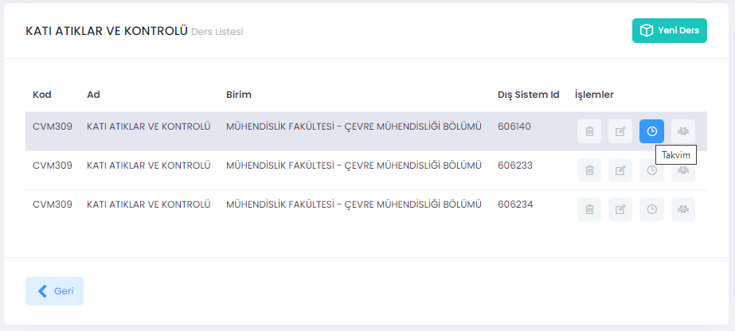

# Takvim

**Takvim** seçildiğinde günlük, haftalık veya aylık ölçekte planlanmış faaliyetler görülür. **Takvim**e faaliyetler yöneticiler tarafından işlenir. Takvim üzerinde iler geri giderek inceleme yapmak mümkündür. Oluşturulacak bir sanal sınıf mutlaka takvimde var olan bir etkinlik ilişkilendirilmelidir.

   
