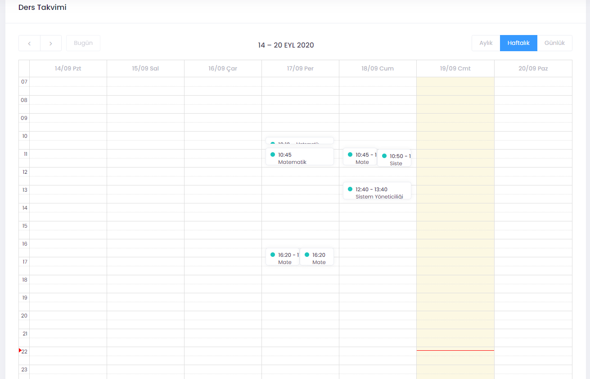

# Takvim

**Takvim** UZEP yöneticileri tarafından dönem başında girilir. **Takvim** seçildiğinde günlük, haftalık veya aylık ölçekte planlanmış program görülür. Öğretim elemanı **Takvim** üzerinde değişiklik yapamaz, sadece görebilir. Sanal sınıflar **Takvim** ile ilişkilendirilir. **Takvim**i boş olan bir öğretim elemanı sanal sınıf oluşturamaz.  

 

Şekil 1. Takvim sayfası. 

