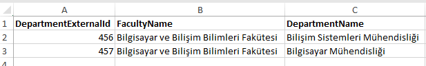
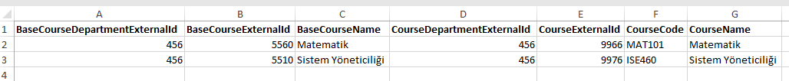
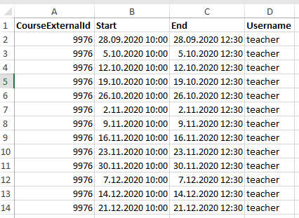
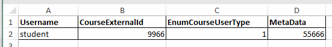
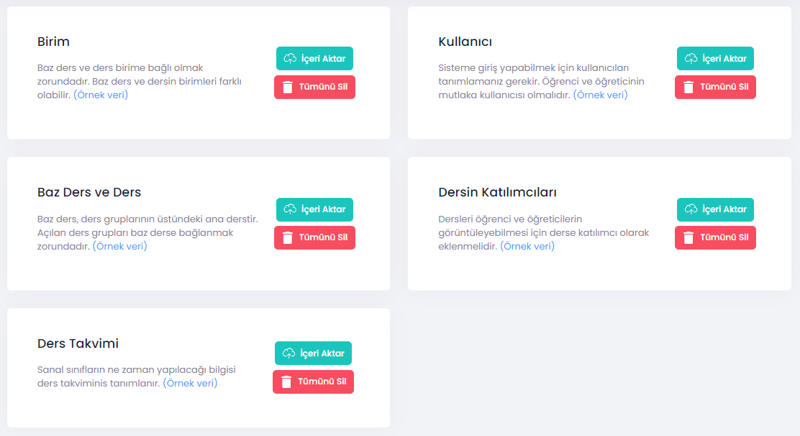

# Veri aktarımı

Üniveriste Yönetim Sistemi'nden (ÜYS) veri aktarımı için iki yol bulunmaktadır. Bunlardan birisi ÜYS ile UZEP arasında yapılan protokol ile sağlanan web servislerini kullanmak, diğeri ise kayıtların ÜYS'den dosyaya (Excel) indirilip, gerekli düzenlemeleri yaptıktan sonra UZEP'e yüklemek şeklindedir. Bu dönem veri aktarımı için Excel dosya üzerinden transfer yöntemi kullanılacaktır. Sorunsuz bir veri aktarımı için Excel dosyalarındaki verilerin UZEP'in beklediği biçimde olması gerekmektedir. UZEP veri akatarımı kısmında veri yükleme kısmında örnek Excel dosyalar bulunmaktadır. Bu dosyalar sistemin beklediği şekilde biçimlendirilmiştir, dolayısı ile önce bu dosyaları indirip ÜYS'den başka Excel dosyalara indirilen verileri kopyalayarak kolonları dikkatlice gözeterek bu dosyalara yapıştırmak en uygun yol olacaktır.  

Aktarılacak veriler ve açıklamaları şöyledir: 
**1. Birimler:** Üniversite hiyerarşisi içinde Fakülte, Meslek Yüksek Okulları (MYO), Enstitüler ve bunların altındaki bölümler ve programlar birimler olarak adlandırılmıştır. 
**2. Dersler:** Üniversitenin tüm birimlerinde tanımlı ve bölümlerin ders planlarında yer alan dersler.
**3. Kullanıcılar (öğrenci, öğretim elemanları, herkes):** Üniversitede ders veren öğretim elemanları ve kayıtlı öğrenciler. İstenirse dışarıdan davetli de derse katılabilir, bunun için bireysel olarak kullanıcı eklenmesi gerekmektedir. 
**4. Ders takvimi:** Üniversite bölümlerinin haftalık ders programları. Ders programlarının sanal ders programı ile aynı olması gerekmez. Sisteme örgün bir program girilebilir, sanal dersler bu programa uygun veya farklı yerlerde icra edilebilir.
**5. Ders katılımcıları:** Sanal derslere tanımlanan kullanıclar, öğrenciler ve öğretim elemanları.

Aktarılacak verilerin biçimleri örnek olarak aşağıdaki şekillerde verilmiştir.
  

Şekil 1. Birimler dosyası biçimi (Fakülteler, MYO'lar, Enstitüler ve bu birimlerin altında bulunan bölümler/programlar). 
 
  

Şekil 2. Dersler dosyası biçimi (Baz dersler ve şube dersler). 

  

Şekil 3. Kullanıcılar dosyası (Yöneticiler, öğretim elemanları ve öğrenciler). 

   

Şekil 4. Ders takvimi dosya biçimi (Haftalık ders programları). 

  

Şekil 5. Ders katılımcıları dosyası biçimi (Derslere kaydolmuş öğrenciler veya öğretici olarak görevlendirilmiş öğretim elemanları). 

    

Şekil 6. UZEP'e Excel dosya kullanarak veri aktarım arayüzü. 

**İşlem basamakları:**
1. Veri aktarımını doğru bir şekilde yapabilmek için UZEP arayüzündeki örnek dosyayı indirin.
2. Bu dosya içindeki ilk satırı (başlık satırını) koruyarak diğer verileri silin.
3. Üniveriste Yönetim Sisteminden indirdiğiniz verileri başka bir Excel sayfasında hazır edin.
4. Hazır edilen sayfayı kontrol ettikten sonra (gerekiyorsa düzenleme yaparak) UZEP'ten indirilen sayfaya, kolonları gözeterek yapıştırın.
5. Excel dosyayı **İçeri Aktar** butonunu kullanarak UZEP'e yükleyin.

Tüm veriler aktarldığında UZEP dönem için kullanıma hazır olacaktır. Bu noktadan sonra tekil değişiklikler UZEP-Admin arayüzlerinden yapılabilir.